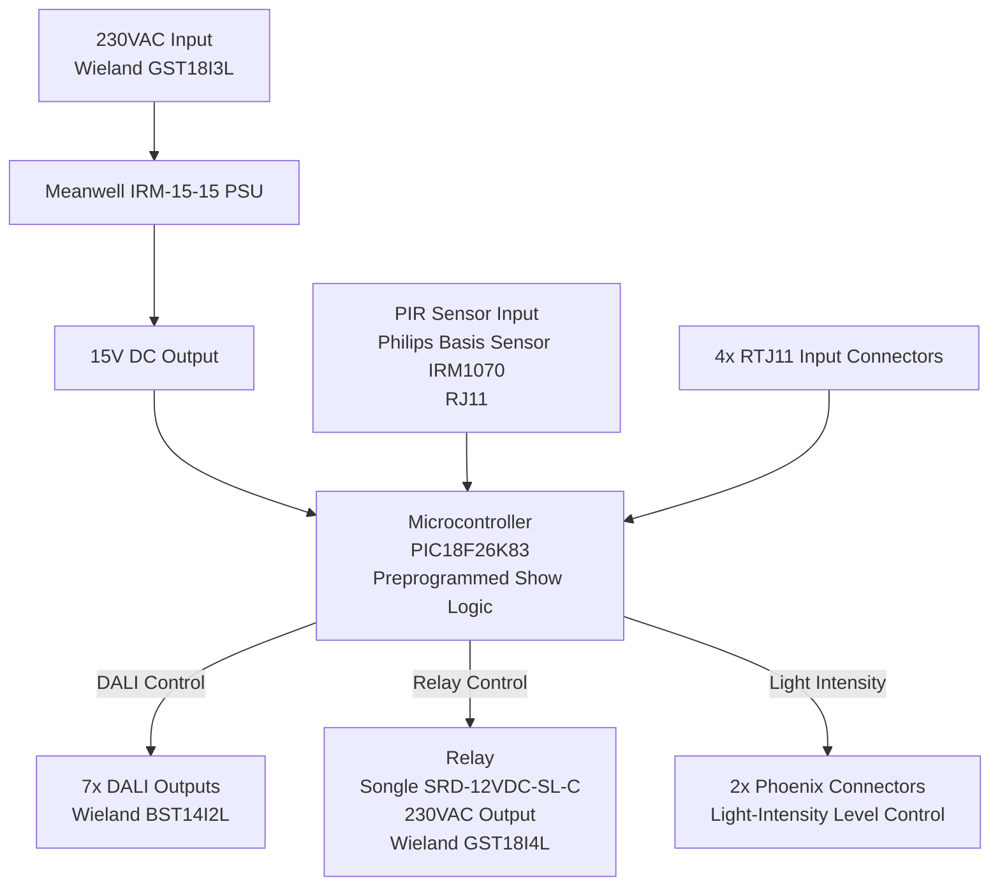

# CE Approval Document

**Product Name:** Custom DALI2/PIR Controller with Relay Output  
**Revision:** 1.0  
**Date:** April 14, 2026  
**Prepared by:** Victor Westerlund  
**Organization:** Claylight APS  

---

## Table of Contents

1. [Product Description](#1-product-description)
2. [Block Diagram](#2-block-diagram)
3. [Schematics](#3-schematics)
4. [Bill of Materials (BOM)](#4-bill-of-materials-bom)
5. [Datasheets](#5-datasheets)
6. [PCB Layouts](#6-pcb-layouts)
7. [Firmware](#7-firmware)
8. [Compliance Documentation](#8-compliance-documentation)
9. [Test Reports](#9-test-reports)
10. [User Manual](#10-user-manual)
11. [Declaration of Conformity](#11-declaration-of-conformity)

---

## 1. Product Description

### Overview

The Custom DALI2/PIR Controller is designed for automated lighting control in commercial or residential environments. It interfaces with a Philips Basis Sensor IRM1070 PIR sensor and provides DALI2-compatible outputs for lighting management.

### Key Features

**Inputs:**
- 230VAC power input via Wieland GST18I3L connector.
- PIR sensor input via RJ11 connector.
- 4x RTJ11 input connectors for additional signals.

**Outputs:**
- 7x DALI outputs via Wieland BST14I2L connectors.
- 1x relay-controlled 230VAC output via Wieland GST18I4L connector.
- 2x Phoenix connectors for light-intensity level control.

**Preprogrammed Logic:**
- Lights turn on at 90% brightness for 5 minutes on PIR activation.
- Transition to 20% brightness for 20 minutes.
- All lights turn off after 20 minutes.
- Relay output follows the same logic.
- Show length can only be reprogrammed by the Claylight technical team.

---

## 2. Block Diagram

---

## 3. Schematics

> ⚠️ _Attach schematic files (PDF or image) to this document before submission._

### Power Supply Section
- 230VAC Input → Meanwell IRM-15-15 PSU → 15V DC Output.

### Microcontroller Section
- PIC18F26K83 with DALI, relay, and PIR interfaces.

### Relay Section
- Songle SRD-12VDC-SL-C relay for 230VAC switching.

### DALI Interface
- 7x DALI outputs via Wieland BST14I2L connectors.

### PIR Sensor Interface
- RJ11 connector for Philips Basis Sensor IRM1070.

---

## 4. Bill of Materials (BOM)

| Component                    | Description                 | Quantity |
|------------------------------|-----------------------------|----------|
| Meanwell IRM-15-15           | 15W AC-DC Power Supply      | 1        |
| PIC18F26K83                  | Microcontroller             | 1        |
| Songle SRD-12VDC-SL-C        | Relay                       | 1        |
| Wieland GST18I3L             | 230VAC Input Connector      | 1        |
| Wieland BST14I2L             | DALI Output Connector       | 7        |
| Wieland GST18I4L             | Relay Output Connector      | 1        |
| Philips Basis Sensor IRM1070 | PIR Sensor                  | 1        |
| Phoenix Connectors           | Light-Intensity Control     | 2        |
| RTJ11 Connectors             | Additional Inputs           | 4        |

---

## 5. Datasheets

> ⚠️ _Attach or link the following datasheets before submission._

- [ ] Meanwell IRM-15-15 PSU Datasheet
- [ ] Songle SRD-12VDC-SL-C Relay Datasheet
- [ ] PIC18F26K83 Microcontroller Datasheet
- [ ] Philips Basis Sensor IRM1070 Datasheet
- [ ] Wieland GST18I3L / BST14I2L / GST18I4L Connector Datasheets

---

## 6. PCB Layouts

> ⚠️ _Attach or link the following PCB layout files before submission._

- [ ] **Top Layer:** _(Attach image)_
- [ ] **Bottom Layer:** _(Attach image)_
- [ ] **Gerber Files:** Include all layers (top, bottom, silk, mask).

---

## 7. Firmware

Firmware source is maintained in this repository as the implementation reference for CE review.

- [x] **Microcontroller Code:** Source code for the PIC18F26K83 is included in this repository. See [README.md](README.md), [main.c](main.c), and [mcc_generated_files](mcc_generated_files).
- [x] **DALI Protocol Implementation:** The firmware uses the PIC18F26K83 built-in Microchip DALI-capable UART functionality and standard IEC 62386 command sequences. See [README.md](README.md), [dali_init.c](dali_init.c), [dali.c](dali.c), and [dali_fade.c](dali_fade.c).
- [x] **Relay Control Logic:** Relay timing follows the occupancy state machine implemented in [main.c](main.c) and the hardware output control in [relay.c](relay.c).

---

## 8. Compliance Documentation

### CE Marking

| Directive                              | Standard   | Status                  |
|----------------------------------------|------------|-------------------------|
| Low Voltage Directive (LVD) 2014/35/EU | EN 62368-1 | ☐ Pending / ☑ Compliant |
| EMC Directive 2014/30/EU (Emissions)   | EN 55032   | ☐ Pending / ☑ Compliant |
| EMC Directive 2014/30/EU (Immunity)    | EN 55035   | ☐ Pending / ☑ Compliant |

### Safety Standards

- **Isolation:** Confirm isolation between high-voltage (230VAC) and low-voltage sections.
- **Creepage and Clearance:** Verify distances meet the requirements of EN 62368-1.

### Risk Assessment

> ⚠️ _Complete the risk assessment table below._

| Hazard                  | Severity | Likelihood | Mitigation Measure                              |
|-------------------------|----------|------------|-------------------------------------------------|
| Electric shock (230VAC) | High     | Low        | Protective enclosure, proper insulation         |
| Overheating of PSU      | Medium   | Low        | Rated thermal design, ventilation               |
| Relay contact failure   | Medium   | Low        | Rated relay selected, functional testing        |
| EMC interference        | Low      | Medium     | Shielding, filtering, tested per EN 55032/55035 |

---

## 9. Test Reports

> ⚠️ _Attach completed test reports before submission._

### Safety Testing

- [ ] Dielectric strength (hipot) test
- [ ] Insulation resistance test
- [ ] Leakage current test

### EMC Testing

- [ ] Radiated and conducted emissions (EN 55032)
- [ ] ESD immunity
- [ ] Surge immunity
- [ ] Fast transient (burst) immunity (EN 55035)

### Functional Testing

- [ ] DALI communication integrity
- [ ] Relay switching reliability
- [ ] PIR sensor functionality
- [ ] Preprogrammed show logic verification (90% → 20% → off)

---

## 10. User Manual

> ⚠️ _Attach the full User Manual before submission. Key sections to include:_

### Installation Instructions
- Step-by-step guide for qualified electricians.
- Wiring diagrams for 230VAC input, DALI outputs, and relay output.

### Operating Instructions
- How to use and configure the controller.
- Description of PIR-triggered show logic.

### Maintenance and Safety Warnings
- High-voltage warning: Installation must be performed by a qualified electrician.
- Do not open the enclosure when powered.
- Handling and disposal instructions (RoHS / WEEE compliance).

---

## 11. Declaration of Conformity

---

We, the undersigned, declare under our sole responsibility that the product described below conforms to the provisions of the relevant European Union directives and standards.

| Field                 | Details                                       |
|-----------------------|-----------------------------------------------|
| **Product Name**      | Custom DALI2/PIR Controller with Relay Output |
| **Revision**          | 1.0                                           |
| **Manufacturer**      | Claylight APS                                 |
| **Directives**        | LVD 2014/35/EU, EMC Directive 2014/30/EU      |
| **Standards Applied** | EN 62368-1, EN 55032, EN 55035                |
| **Date of Issue**     | April 14, 2026                                |

---

**Authorized Signatory:**

Name: Victor Westerlund  
Title: _(Title)_  
Organization: Claylight APS  

Signature: ______________________________  

Date: April 14, 2026  

---

> _This document is intended for internal review and regulatory submission. All sections marked ⚠️ must be completed with supporting materials before final submission.