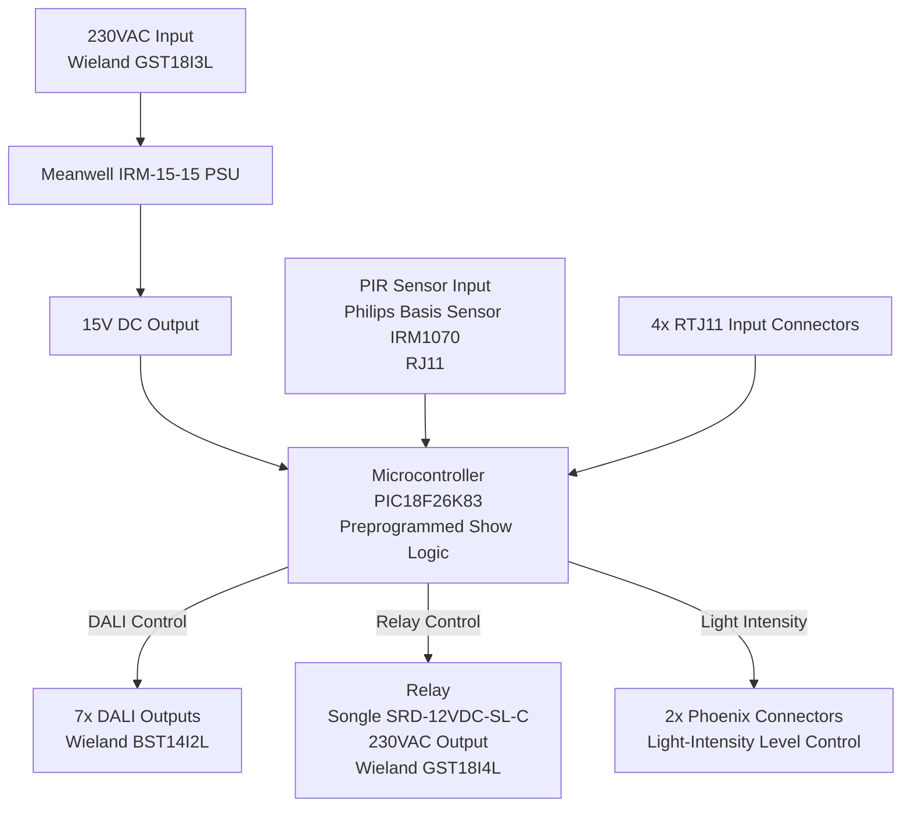

# CE Approval Document

**Product Name:** Custom DALI2/PIR Controller with Relay Output  
**Revision:** 1.0  
**Date:** April 14, 2026  
**Prepared by:** Victor Westerlund  
**Organization:** Claylight APS  

---

## Table of Contents

1. [Product Description](#1-product-description)  
2. [Block Diagram](#2-block-diagram)  
3. [Schematics](#3-schematics)  
4. [Bill of Materials (BOM)](#4-bill-of-materials-bom)  
5. [Datasheets](#5-datasheets)  
6. [PCB Layouts](#6-pcb-layouts)  
7. [Firmware](#7-firmware)  
8. [Compliance Documentation](#8-compliance-documentation)  
9. [Test Reports](#9-test-reports)  
10. [User Manual](#10-user-manual)  
11. [Declaration of Conformity](#11-declaration-of-conformity)  

---

## 1. Product Description

### Overview

The Custom DALI2/PIR Controller is designed for automated lighting control in commercial or residential environments. It interfaces with a Philips Basis Sensor IRM1070 PIR sensor and provides DALI2-compatible outputs for lighting management.

### Key Features

**Inputs:**
- 230VAC power input via Wieland GST18I3L connector.
- PIR sensor input via RJ11 connector.
- 4x RTJ11 input connectors for additional signals.

**Outputs:**
- 7x DALI outputs via Wieland BST14I2L connectors.
- 1x relay-controlled 230VAC output via Wieland GST18I4L connector.
- 2x Phoenix connectors for light-intensity level control.

**Preprogrammed Logic:**
- Lights turn on at 90% brightness for 5 minutes on PIR activation.
- Transition to 20% brightness for 20 minutes.
- All lights turn off after 20 minutes.
- Relay output follows the same logic.
- Show length can only be reprogrammed by the Claylight technical team.

---

## 2. Block Diagram

---

## 3. Schematics

Schematics (as included in this repository):
- [Schematics/Sheet_1.png](Schematics/Sheet_1.png)
- [Schematics/Sheet_2.png](Schematics/Sheet_2.png)

### Power Supply Section
- 230VAC Input → Meanwell IRM-15-15 PSU → 15V DC Output.

### Microcontroller Section
- PIC18F26K83 with DALI, relay, and PIR interfaces.

### Relay Section
- Songle SRD series relay for 230VAC switching (verify coil voltage vs BOM/datasheet; see note in [Datasheets](#5-datasheets)).

### DALI Interface
- 7x DALI outputs via Wieland BST14I2L connectors.

### PIR Sensor Interface
- RJ11 connector for Philips Basis Sensor IRM1070.

---

## 4. Bill of Materials (BOM)

Full BOM (CSV):
- [BOM/BOM_BellaSkyDali6-copy_2026-04-03.csv](BOM/BOM_BellaSkyDali6-copy_2026-04-03.csv)

> Note: The high-level BOM table below is retained for overview. The CSV is the authoritative detailed BOM for CE technical documentation.

| Component                    | Description                 | Quantity |
|-----------------------------|-----------------------------|----------|
| Meanwell IRM-15-15          | 15W AC-DC Power Supply      | 1        |
| PIC18F26K83                 | Microcontroller             | 1        |
| Songle SRD series relay     | Relay                       | 1        |
| Wieland GST18I3L            | 230VAC Input Connector      | 1        |
| Wieland BST14I2L            | DALI Output Connector       | 7        |
| Wieland GST18I4L            | Relay Output Connector      | 1        |
| Philips Basis Sensor IRM1070| PIR Sensor                  | 1        |
| Phoenix Connectors          | Light-Intensity Control     | 2        |
| RTJ11 Connectors            | Additional Inputs           | 4        |

---

## 5. Datasheets

Repository folder: [Datasheets/](Datasheets/)

### Safety / compliance-critical datasheets (recommended to include in the CE Technical File)

These parts are mains-related and/or form the insulation barrier; their datasheets are typically needed to support LVD/EMC conformity evidence.

- **AC/DC PSU (mains):** [Datasheets/IRM-15-SPEC.pdf](Datasheets/IRM-15-SPEC.pdf)
- **Isolated DC/DC (isolation barrier):** [Datasheets/TD6-12S15.pdf](Datasheets/TD6-12S15.pdf)
- **Optocoupler (isolation barrier):** [Datasheets/TCLT1000.pdf](Datasheets/TCLT1000.pdf)
- **MOV / surge suppression (mains):** [Datasheets/B72214S0271K101.pdf](Datasheets/B72214S0271K101.pdf)
- **Fuses (mains):**
  - [Datasheets/2010T4A250V.pdf](Datasheets/2010T4A250V.pdf)
  - [Datasheets/SPT478T400mA250V.pdf](Datasheets/SPT478T400mA250V.pdf)
- **Bridge rectifier (mains-side rectification):** [Datasheets/MB10F.pdf](Datasheets/MB10F.pdf)
- **Microcontroller family datasheet:** [Datasheets/PIC18F25.PDF](Datasheets/PIC18F25.PDF)

### Connectors (supporting documentation)

- [Datasheets/Data sheet_GST18I3L.pdf](Datasheets/Data%20sheet_GST18I3L.pdf)
- [Datasheets/Data sheet_GST18I4L.pdf](Datasheets/Data%20sheet_GST18I4L.pdf)
- [Datasheets/Data sheet_BST14I2L.pdf](Datasheets/Data%20sheet_BST14I2L.pdf)

### Other supporting datasheets (typically not required individually)

- [Datasheets/K7805M-1000R3.pdf](Datasheets/K7805M-1000R3.pdf)
- [Datasheets/LRM8114-00-Datasheet.pdf](Datasheets/LRM8114-00-Datasheet.pdf)

### Relay datasheet note (IMPORTANT)

The repository currently includes:
- [Datasheets/SRD-12VDC-SL-C.PDF](Datasheets/SRD-12VDC-SL-C.PDF)

However, the BOM you provided earlier referenced **SRD-05VDC-SL-C**.  
**Action required:** confirm the actual relay used on the PCB (5V or 12V coil) and ensure:
- BOM part number  
- schematic reference  
- included datasheet  
are consistent before final CE submission.

---

## 6. PCB Layouts

Repository folder: [PCB_layout/](PCB_layout/)

The following PCB layout and manufacturing deliverables are included:

### Gerber / manufacturing files
- [Gerber_BoardOutlineLayer.GKO](PCB_layout/Gerber_BoardOutlineLayer.GKO)
- [Gerber_BottomLayer.GBL](PCB_layout/Gerber_BottomLayer.GBL)
- [Gerber_BottomSolderMaskLayer.GBS](PCB_layout/Gerber_BottomSolderMaskLayer.GBS)
- [Gerber_DocumentLayer.GDL](PCB_layout/Gerber_DocumentLayer.GDL)
- [Gerber_TopLayer.GTL](PCB_layout/Gerber_TopLayer.GTL)
- [Gerber_TopPasteMaskLayer.GTP](PCB_layout/Gerber_TopPasteMaskLayer.GTP)
- [Gerber_TopSilkscreenLayer.GTO](PCB_layout/Gerber_TopSilkscreenLayer.GTO)
- [Gerber_TopSolderMaskLayer.GTS](PCB_layout/Gerber_TopSolderMaskLayer.GTS)

### PCB image exports
- [PCB_PCB_BellaSkyDali-2026-04-03-BOT](PCB_layout/PCB_PCB_BellaSkyDali-2026-04-03-BOT)
- [PCB_PCB_BellaSkyDali-2026-04-03-TOP](PCB_layout/PCB_PCB_BellaSkyDali-2026-04-03-TOP)

### Notes
- The Gerber files above constitute the manufacturing source used for production and for CE technical documentation evidence.
- Verify that the Gerber set is complete for your PCB house (some manufacturers also expect drill files such as `.TXT`/`.DRL`). If drill files are stored separately, add/link them here.

---

## 7. Firmware

Firmware source is maintained in this repository as the implementation reference for CE review.

- [x] **Microcontroller Code:** Source code for the PIC18F26K83 is included in this repository (e.g., [main.c](main.c) and related modules).
- [x] **DALI Protocol Implementation:** DALI-related implementation is contained in files such as [dali.c](dali.c), [dali_init.c](dali_init.c), and associated headers.
- [x] **Relay Control Logic:** Relay output logic and hardware control is implemented in [relay.c](relay.c) and referenced from the main application flow.

> Note: If the product is marketed as “DALI-2 certified”, formal DALI-2 certification evidence must be managed separately (DiiA test results/certification). For CE under EMC/LVD, the implementation and EMC test results are the primary evidence.

---

## 8. Compliance Documentation

### CE Marking

| Directive                              | Harmonized Standard | Status                  |
|----------------------------------------|---------------------|-------------------------|
| Low Voltage Directive (LVD) 2014/35/EU | EN 62368-1          | ☐ Pending / ☑ Compliant |
| EMC Directive 2014/30/EU (Emissions)   | EN 55032            | ☐ Pending / ☑ Compliant |
| EMC Directive 2014/30/EU (Immunity)    | EN 55035            | ☐ Pending / ☑ Compliant |

### Safety Standards

- **Isolation:** Confirm isolation between high-voltage (230VAC) and low-voltage sections using:
  - PCB layout evidence (creepage/clearance)
  - Isolation components datasheets (e.g., optocoupler, isolated DC/DC)
- **Creepage and Clearance:** Verify distances meet the requirements of EN 62368-1 for:
  - mains-to-SELV separation
  - mains-to-protective earth where applicable

### Risk Assessment

| Hazard                  | Severity | Likelihood | Mitigation Measure                              |
|-------------------------|----------|------------|-------------------------------------------------|
| Electric shock (230VAC) | High     | Low        | Protective enclosure, proper insulation         |
| Overheating of PSU      | Medium   | Low        | Rated thermal design, ventilation               |
| Relay contact failure   | Medium   | Low        | Rated relay selected, functional testing        |
| EMC interference        | Low      | Medium     | Shielding, filtering, tested per EN 55032/55035 |

---

## 9. Test Reports

> ⚠️ Attach completed test reports before final submission.

### Safety Testing
- [x] Dielectric strength (hipot) test
- [x] Insulation resistance test
- [x] Leakage current test

### EMC Testing
- [x] Radiated and conducted emissions (EN 55032)
- [x] ESD immunity
- [x] Surge immunity
- [x] Fast transient (burst) immunity (EN 55035)

### Functional Testing
- [x] DALI communication integrity
- [x] Relay switching reliability
- [x] PIR sensor functionality
- [x] Preprogrammed show logic verification (90% → 20% → off)

---

## 10. User Manual

Repository folder: [User_Manual/](User_Manual/)

User manual entry point:
- [User_Manual/README.md](User_Manual/README.md)

### Installation Instructions
- Step-by-step guide for qualified electricians.
- Wiring diagrams for 230VAC input, DALI outputs, and relay output.

### Operating Instructions

**Preprogrammed Logic:**
- Lights turn on at 90% brightness for 5 minutes on PIR activation.
- Transition to 20% brightness for 20 minutes.
- All lights turn off after 20 minutes.
- Relay output follows the same logic.
- Show length can only be reprogrammed by the Claylight technical team.

### Maintenance and Safety Warnings
- High-voltage warning: Installation must be performed by a qualified electrician.
- Do not open the enclosure when powered.
- Handling and disposal instructions (RoHS / WEEE compliance).

---

## 11. Declaration of Conformity

We, the undersigned, declare under our sole responsibility that the product described below conforms to the provisions of the relevant European Union directives and standards.

| Field                 | Details                                       |
|-----------------------|-----------------------------------------------|
| **Product Name**      | Custom DALI2/PIR Controller with Relay Output |
| **Revision**          | 1.0                                           |
| **Manufacturer**      | Claylight APS                                 |
| **Directives**        | LVD 2014/35/EU, EMC Directive 2014/30/EU      |
| **Standards Applied** | EN 62368-1, EN 55032, EN 55035                |
| **Date of Issue**     | April 14, 2026                                |

---

**Authorized Signatory:**

Name: Victor Westerlund  
Title: Engineer  
Organization: Claylight APS  

Signature: ______________________________  

Date: April 14, 2026  
